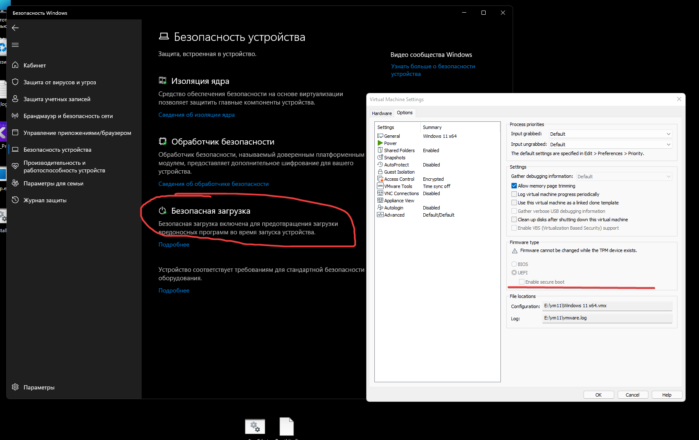

# **uefi secureboot variable interceptor**

**research project demonstrating runtime interception of uefi variable access during the boot process**

this project implements a **runtime hook for `efi_runtime_services->getvariable`**, allowing controlled responses when firmware variables are queried by the bootloader.

the application installs the hook and then transparently transfers execution to the original **windows boot manager**.

---

# **features**

- intercepts **uefi runtime variable access**
- custom handler for **secureboot variable**
- preserves original firmware behavior for all other variables
- transparent **boot chain continuation**
- minimal footprint during the boot process

---

one important variable is: `guid: efi_global_variable`
this variable is used by the windows boot manager to determine whether **secure boot is enabled**.

the project implements a **fake secure boot response** by intercepting the request and returning a controlled value instead of the firmware-provided one.

---

# **fake secure boot flow**

uefi firmware -> runtime services -> efi_runtime_services->getvariable -> custom hook (wsgetvariable) -> fake secureboot value -> windows boot manager -> normal boot process

---

this project is provided **for educational and research purposes only**.
